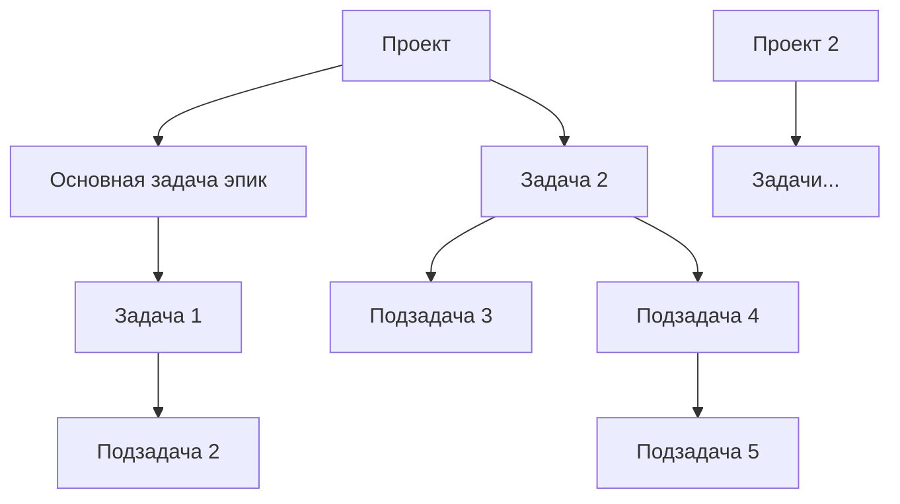

# Схема работы с проектами встроенными в OneKanban (БСП)

:::info

Эта схема справедлива только для работы в произвольных конфигурациях на БСП

:::

На первом уровне должен быть **Проект**, а вот задачи могут быть как обычные так и основные(эпик), на выбор пользователя.